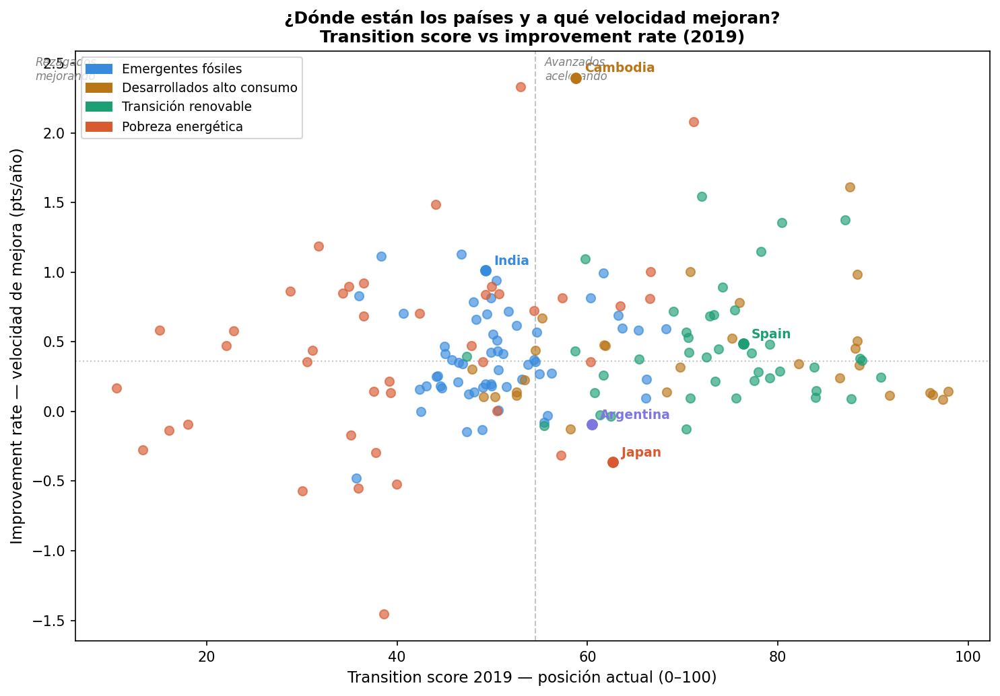
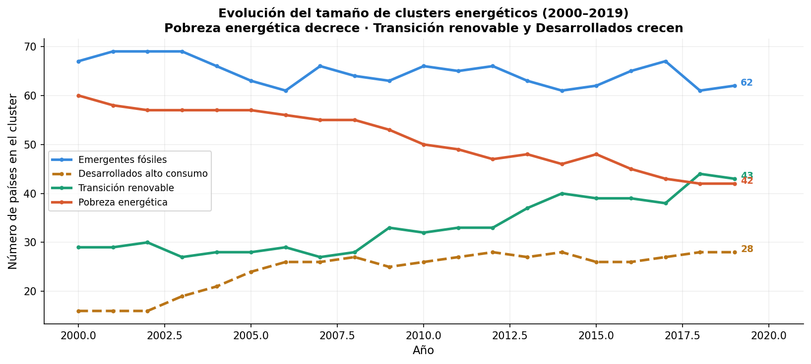
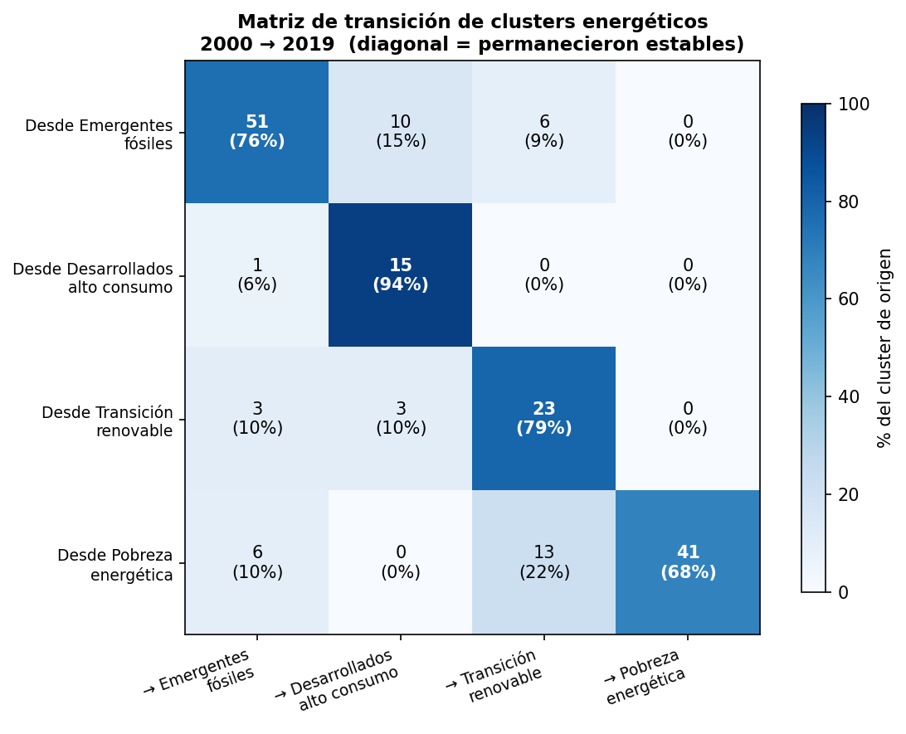

# Global Energy Transition Analysis (2000–2023)

> **Useful for:** ESG analysts evaluating country-level transition trajectories, development agencies prioritizing clean energy investments, and policy researchers studying energy path dependence.

End-to-end data analytics project covering 176 countries and 24 years of sustainable energy indicators. From raw data cleaning to clustering, feature engineering, regression, out-of-sample validation, and methodological weight analysis.

---

## Key visuals

**Where are countries and how fast are they improving?**



**How did cluster composition change over 20 years?**



**Which countries changed energy profile and where did they go?**



---

## Key findings

**The biomass paradox.** Countries with the least electricity access appear to have the highest renewable energy share — because traditional biomass (firewood, agricultural waste) counts as renewable. This is energy poverty, not energy transition. The correlation between electricity access and renewable share is r = −0.79.

**Energy systems have enormous inertia.** In the regression model, the single strongest predictor of a country's 2019 energy profile is its low-carbon electricity percentage from the year 2000 — not GDP, not growth rate. Infrastructure decisions made 20+ years ago still define the matrix today.

**76% of countries kept their energy cluster between 2000 and 2019.** Of the 42 that changed, most moved upward (toward clean transition or developed), with one notable exception: Japan, whose low-carbon electricity dropped from 41% to 14% after Fukushima (2011).

**Cambodia is the most remarkable case in the dataset.** Starting from near zero (16% electricity access, GDP $300/capita in 2000), it achieved the highest improvement rate in the world (+2.40 pts/year) by building directly from renewables — no fossil system to dismantle.

**Argentina is the most instructive cautionary tale.** It had a clean energy advantage in 2000 (41% low-carbon electricity) and lost it by 2019 (34%). Repeated macroeconomic crises prevented energy investment. It has wind, solar, and hydro resources to lead a regional transition — but not the policy stability to capitalize on them.

---

## Clusters identified (2019)

| Cluster | Countries | Electricity access | Low-carbon elec | GDP per capita |
|---------|-----------|-------------------|-----------------|----------------|
| Energy poverty | 42 | 45% | 39% | $1,786 |
| Fossil emerging | 62 | 97% | 15% | $10,867 |
| Renewable transition | 43 | 95% | 68% | $8,334 |
| Developed high-consumption | 28 | 100% | 47% | $56,784 |

---

## Engineered features

Four composite variables built from the cleaned dataset:

- **transition_score** — overall energy transition progress (0–100), weighted combination of electricity access, low-carbon electricity, and log(GDP)
- **improvement_rate** — annual velocity of score improvement from 2000 to 2019
- **clean_access_ratio** — quality of electricity access: penalizes dirty electrification
- **fossil_lock_in** — structural dependency on fossil fuels

**Weight validation:** the manually chosen weights (0.30 / 0.45 / 0.25) were validated against Ridge regression coefficients (r = 0.9995) and compared against PCA-derived weights. PCA reveals that electricity access + GDP and low-carbon electricity are structurally independent axes in the data — confirming that explicitly weighting clean energy was a deliberate design decision, not an arbitrary one.

---

## Regression model

**Target:** `transition_score`  
**Best model:** Ridge Regression (R² = 0.822, MAE = 5.22 points, 5-fold CV)

| Feature | Importance |
|---------|-----------|
| Low-carbon electricity 2000 | 47.5% |
| Electricity access 2019 | 18.8% |
| Energy per capita (log) | 15.1% |
| GDP per capita (log) | 8.5% |
| Other | 10.2% |

**Known limitation:** the transition_score is partially composed of the same variables used as features (access, low-carbon, GDP), creating partial data leakage. The R²=0.82 reflects path dependence more than pure predictive power — which is itself the key finding: where a country starts energetically is the strongest predictor of where it ends up.

**Multicollinearity audit (script 13):** VIF analysis confirms severe collinearity between log_gdp and log_energy (VIF > 300, r=0.914) and between access_2019 and access_2000 (VIF > 60, r=0.867). The previously reported R² gap between Linear (0.33) and Ridge (0.82) was a preprocessing bug — with identical scaling, both models yield R² ≈ 0.823.

---

## Out-of-sample validation (2021–2023)

| Metric | Value |
|--------|-------|
| MAE original (2019, CV) | 5.22 points |
| MAE validation — complete data (148 countries) | **9.28 points** |
| MAE validation — all countries (176) | 21.25 points |

The higher overall MAE is driven by the 44% of countries without GDP data in new sources — for those, the model predicts without its most important feature. The fair comparison is 9.28 vs 5.22: moderate degradation over a period that included COVID-19 and the 2022 energy crisis.

The model correctly captured Japan's continued decline (−6.8 pts) and Spain's 2022 dip and 2023 recovery — confirming it has real signal, not just retrospective fit.

---

## Known limitations

1. **Partial data leakage in regression** — transition_score components overlap with model features.
2. **Severe multicollinearity** — log_gdp ↔ log_energy (r=0.914), access_2019 ↔ access_2000 (r=0.867).
3. **Cluster 1 heterogeneity** — "Developed high-consumption" mixes Western Europe (transitioning) with Gulf states (not transitioning). Median more representative than mean.
4. **Median imputation in clustering** — null values filled with feature medians before K-Means; may slightly bias centroids.
5. **GDP coverage in validation** — 44% of countries lack GDP data for 2021–2023, inflating overall MAE.

---

## Tech stack

| Tool | Usage |
|------|-------|
| Python 3 | All analysis |
| pandas | Data cleaning, manipulation |
| numpy | Numerical transformations |
| scikit-learn | K-Means, Ridge, Random Forest, cross-validation |
| statsmodels | VIF multicollinearity analysis |
| matplotlib / seaborn | Charts and PDF reports |
| D3.js + TopoJSON | Interactive choropleth map |

---

## Repository structure

```
global-energy-analysis/
│
├── data/
│   └── global-data-on-sustainable-energy.csv   # original dataset (Kaggle)
│
├── images/                                      # charts embedded in this README
│   ├── img_quadrant.png
│   ├── img_cluster_evolution.png
│   └── img_transition_matrix.png
│
├── scripts/                                     # numbered in execution order
│   ├── 01_clean_sustainable_energy.py
│   ├── 02_eda_sustainable_energy.py
│   ├── 03_clustering_dynamics.py
│   ├── 04_feature_engineering.py
│   ├── 05_regression_analysis.py
│   ├── 06_case_studies.py
│   ├── 07_validation_step1_explore.py
│   ├── 08_validation_step2_align.py
│   ├── 08b_validation_step2b_gdp.py
│   ├── 09_validation_step3_predict.py
│   ├── 10_validation_step4_visualize.py
│   ├── 11_score_weights_validation.py
│   ├── 12_score_methods_comparison.py
│   ├── 13_vif_analysis.py
│   └── 14_transition_matrix.py
│
├── outputs/                                     # CSV results
├── reports/                                     # PDF reports
├── logs/
└── project_log.md
```

---

## How to run

Install dependencies:

```bash
pip install pandas numpy matplotlib seaborn scikit-learn statsmodels
```

**Required input:** place the original Kaggle dataset in `data/`:
`global-data-on-sustainable-energy.csv` — available at [kaggle.com/datasets/anshtanwar/global-data-on-sustainable-energy](https://www.kaggle.com/datasets/anshtanwar/global-data-on-sustainable-energy)

Run scripts in order from the `scripts/` folder:

```bash
python 01_clean_sustainable_energy.py    # produces sustainable_energy_clean.csv
python 02_eda_sustainable_energy.py
python 03_clustering_dynamics.py
python 04_feature_engineering.py
python 05_regression_analysis.py
python 06_case_studies.py
python 07_validation_step1_explore.py   # requires internet connection
python 08_validation_step2_align.py
python 08b_validation_step2b_gdp.py
python 09_validation_step3_predict.py
python 10_validation_step4_visualize.py
python 11_score_weights_validation.py
python 12_score_methods_comparison.py
python 13_vif_analysis.py
python 14_transition_matrix.py
```

Each script prints a summary to the console and saves outputs to the working directory.

---

## Data source

[Global Data on Sustainable Energy — Kaggle](https://www.kaggle.com/datasets/anshtanwar/global-data-on-sustainable-energy)

Covers 176 countries, 2000–2020. Validation extended to 2023 using Our World in Data and World Bank API.

---

## Author

Francisco Tornello — Data Analytics portfolio project (2026)  
[github.com/FTornello](https://github.com/FTornello)
